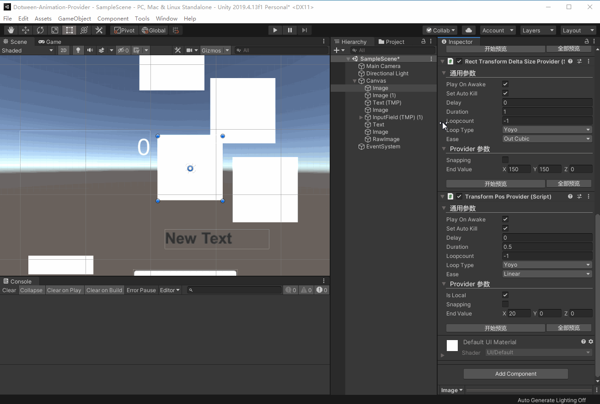
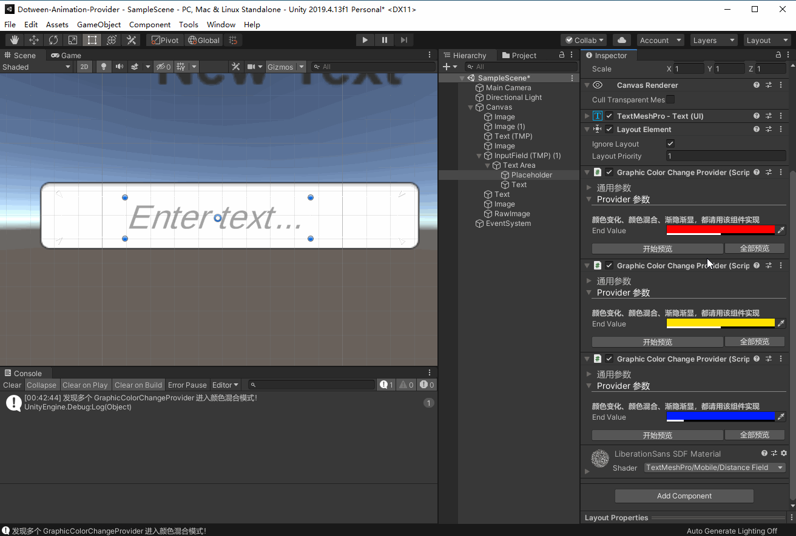
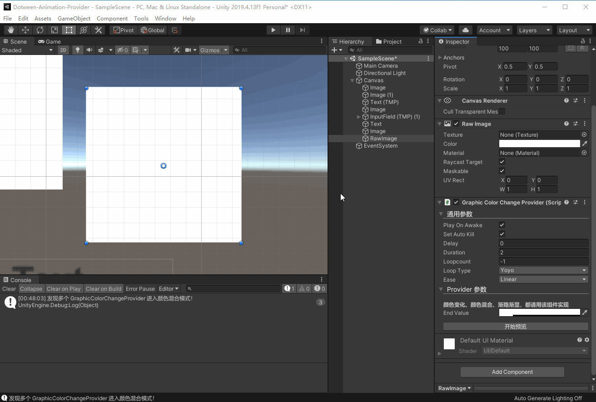
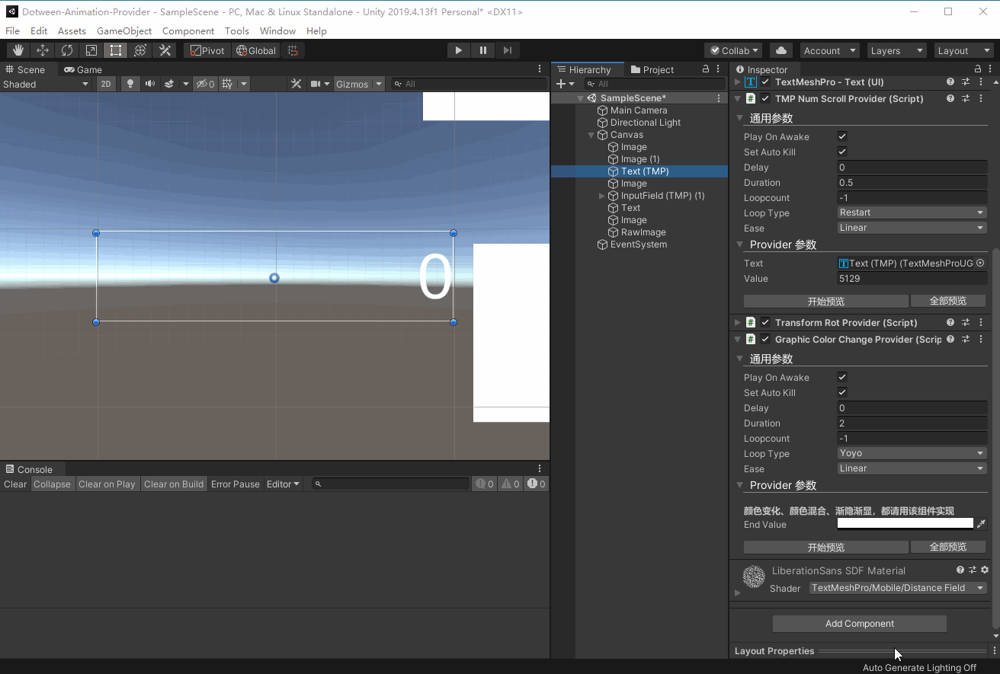
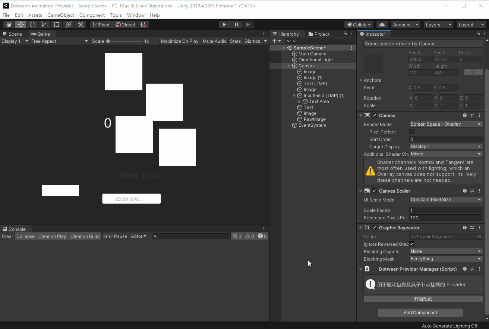

# Dotween Animation Provider

编辑器下无需运行即可预览 Dotween 动画的简易扩展，当然，如果想要更好的体验，可购买 Dotween Pro.

This is a very simple plugin for preview dotween animation in unity editor but without playing state needed. And for more experience pls buy yourself a dotween pro.

# 功能 / Feature
* 提供对游戏对象的 Postion 、 Rotation 、Deltasize 、 Color 补间动画的预览,当然扩展起来方便的一匹。
  Provide Preview for tweening Postion 、 Rotation 、Deltasize 、 Color ，easy extension yourself.
* 组件式，按需挂载，可以组合实现复杂的功能
  Component design in mind, mount on demand, can be combined to achieve complex functions.
  
* 提供多种预览方式。
  There are several way for previewing you tweener.

# 动画 / Gifs 
> Position 、Rotation 、 DeltaSize

> ColorChange ：Colorfade ，colorBlend

> Scrolling Number and color change

> Preview manager on the root heirarchy node.

